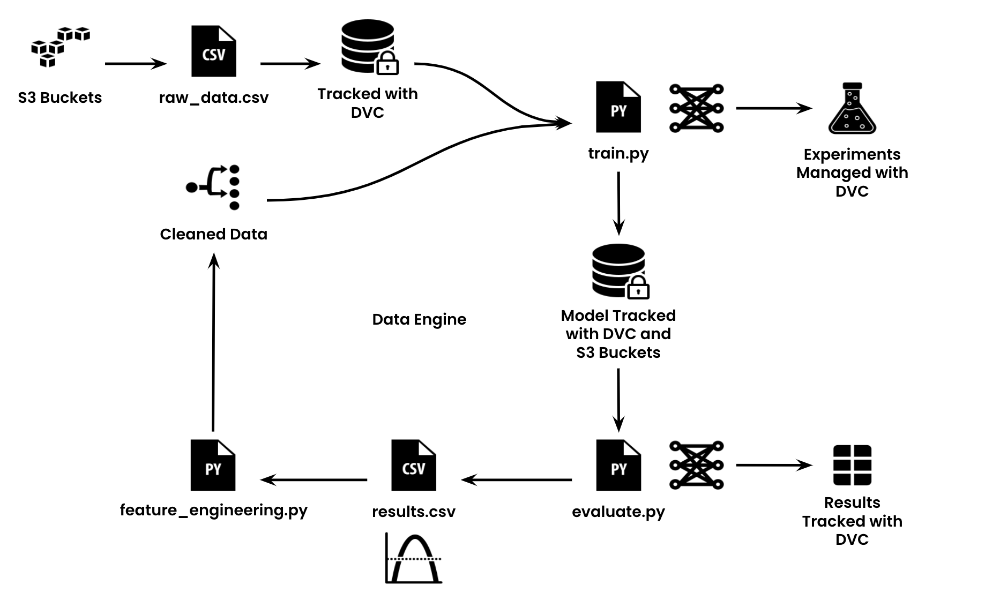

# Data Engine Getting Started

This repo showcases the TAI Frameworks data engine, presents the tools used, and explains how each adds trust to the machine-learning pipeline.

To demonstrate our practices, we've built upon the [fastai beginner tutorial](https://www.kaggle.com/code/hitesh1724/titanic-1-fastai-beginner-tutorial) using the [kaggle titanic dataset](https://www.kaggle.com/competitions/titanic).


## Installation

Python 3.8+ is required to run this repo.

```bash
$ git clone git@github.com:nd-crane/dvcs3-getting-started.git
$ cd dvcs3-getting-started/
```

Let's install the requirements.  In this project we are using a python virtual environment for dependency managaement, but Conda and PDM work as well.

```bash
$ python3 -m venv .venv
$ source .venv/bin/activate
$ pip install -r requirements.txt
```

As depicted above, source data is stored in S3 Buckets with DVC remote storage.  This is a read only HTTP remote.

```bash
$ dvc remote list
myremote     s3://mytestbucket
```

You should run `dvc pull` to download the data.

```bash
$ dvc pull
```

#### Running Experiments

Run `dvc exp run` to reproduce the pipeline:

```bash
$ dvc exp run
Data and pipelines are up to date
```

## Data Engine



As you can see at each stage we apply a different technique to securing the machine learning pipeline.  Each is aimed towards meeting the respective challenges posed while producing structured, interpretable data regarding trust.

### Stages of Trust

Listed below are our four stages along with the tools used at each.

1. Data Storage (S3 Buckets and Dataset Cards)
    - Datasets need to be secured in a central, consistent location that allows for appropriate access control and versioning. Datasets should also have appropriate context and labels.

2. Data Cleaning and Pre-processing (DVC)
    - Datasets must be tracked during the transformation from raw-data to a model-ready form to ensure accuracy and easy reproduction.

3. Model Creation and Training (Model Cards and SBOMs)
    - Models should be tracked in an explainable way in which parameters and results can be measured and compared. Also, they should have appropriate context with their corresponding code and packages.

4. Experiment Evaluation (VSCode Experimentation)
    - Evaluation should allow for iterative experimentation and display training results, hyperparameters, and metrics.

## Initialization

#### Data Storage

Data can be stored in any location as long as it's secure, centralized among collaborators, and structured.  We opt to use S3 buckets for their scalability and capatability features.  This project uses [localstack](https://www.localstack.cloud/), an AWS emulator.  For more information on configuration, please view our [`server-side`](https://github.com/nd-crane/dvcs3-getting-started/tree/server-side) branch.

#### Data Cleaning and Pre-processing

[DVC](https://dvc.org/) is used alongside git to track the data cleaning pipeline.  

To initialize a DVC project inside a Git project run:

```bash
dvc init
```

DVC requires an underlying Git project to properly track data.  If the current directory is not part of a git repository either clone an existing repository or run `git init` prior to initializing DVC.

##### Adding Remote Storage 

DVC supports Amazon S3 buckets for remote storage (in addition to many other options).  To add a remote bucket run:

```bash
dvc remote add -d myremote s3://<bucket>/key
```

With the localstack configuration there will be no key.  Since the localstack endpoint is different from a typical AWS bucket, we need to specify it in the DVC config file.  The `endpointurl` parameter can be modified with the following command:

```bash
dvc remote modify myremore endpointurl http://<domain>:<port>
```

These commands will modify the `.dvc/config` file.  All settings can be written to that file with the appropriate `.ini` format.

With S3 buckets set up data can be pushed with:

```bash
dvc add <file>
dvc push
```

##### Defining a Pipeline

Next we'll define a [data pipeline](https://dvc.org/doc/start/data-management/data-pipelines) to let DVC know which artifacts to track.  While the [pipeline](https://github.com/nd-crane/dvcs3-getting-started/blob/main/dvc.yaml) in our project above consists of only a single stage, production pipelines may be much longer.

Each stage should define a command to execute that stage as well as dependencies, outputs, and optionally parameters, metrics, and plots.  This is defined in the `dvc.yaml` file:

```yaml
stages:
  train_and_evaluate:
    cmd: python src/titanic_example.py
    deps:
      - src/titanic_example.py
      - data/train.csv
      - data/test.csv
      - params.yaml
    params:
      - num_estimators
    outs:
      - model/rnf_classifier.pkl
    plots:
      - results/plots/metrics:
          x: step
          y: accuracy
    metrics:
    - results/metrics.json
```

Once a pipeline is defined, DVC can reproduce the pipieline with the [`dvc repro`](https://dvc.org/doc/command-reference/repro) command:

```bash
$ dvc repro
Data and pipelines are up to date.
```

### Dataset and Model Cards

For the input dataset and created model we generate respective dataset and model cards based on the [Hugging Face format](https://huggingface.co/docs/datasets/dataset_card).  These add context to our inputs and outputs allowing us to identify trends and increase explainability.

The dataset and model cards can be viewed in the respective `data/` and `model/` directories as `READMEs`.  While these are currently manually generated, our goal is to automate this process alongside the DVC remote storage and pipeline processes.

Templates for each of these may be viewed in the `docs/` directory.

### DVC Experimentation

With a complete pipeline we may begin to manage experiments with DVC.  This is done within VSCode.

##### Downloading VSCode 

We must begin by first installing VSCode instead which can be done via this link as shown [here](https://code.visualstudio.com/download).

Next install the following VSCode extensions:
1. DVC
2. DVC extension Pack

##### Editing Model Script

Now to generate both the plots and metrics json we must edit the script to impliment DVCLive. To do this we will start by creating the necessary directories, initalize dvclive, and load in our parameters.

```python
    # Create logs directory if it doesn't exist
    os.makedirs('logs', exist_ok=True)
    
    # Initialize dvclive
    live = Live(dir="logs", dvcyaml=False, report=None)
    
   ...
    
    # Load params
    yaml = YAML(typ="safe")
    with open(params_file) as f:
        params = yaml.load(f)
```

Next we must setup a classifer to train the model over several iterations.

```python
    # Train the model and log metrics over multiple iterations
    rnf_classifier = RandomForestClassifier(n_estimators=params["num_estimators"], n_jobs=-1)
```

Finally we must setup a loop to train the model over a set amount of iterations.

```python
    # Example: Simulate 10 iterations (epochs)
    for epoch in range(10):

        ...
        
        # Log metrics at each epoch
        live.log_metric("accuracy", acc)
        live.next_step()  # Advance to the next step to simulate time progression
```

## Setting Params

`params.yaml` dictates the number of estimators we want to use within our model training.

## Updating .gitingore Files

This file makes sure to keep the Github clean by excluding the enviroment used to run the script, the data files themsleves, the classifer (model output) file, and the logs. The reason for this is so you can simpley clone the repo and then run the experiments yourself without having to worry about file discrepencies.

## Resolving Possible Problems 

One of the probelms we ran into was not being able to get our dvclive to initialize. This was solved by adjusting the pointer to python to the specifc version of python used within the env.